== DVC-E1 – Belege (Git/GitHub)

Öffentliches Repo: https://github.com/MedHabib99/ticket-system-demo
PR an Upstream (edlich/education): https://github.com/edlich/education/pull/557

// Schritt 1–2
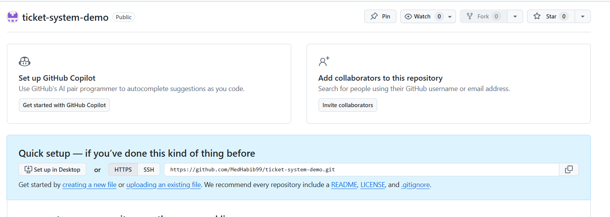
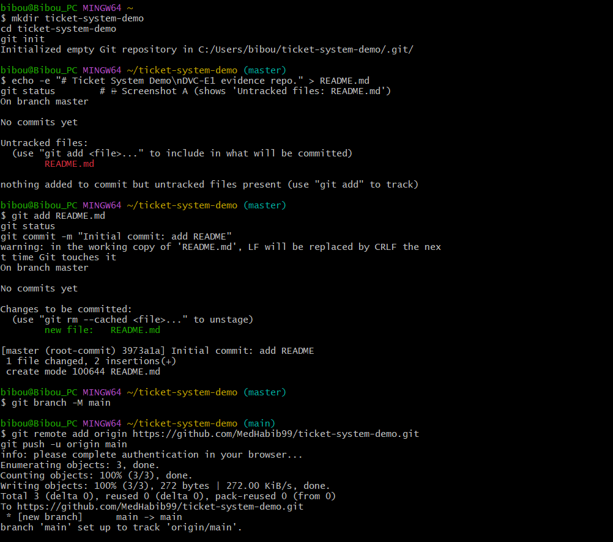
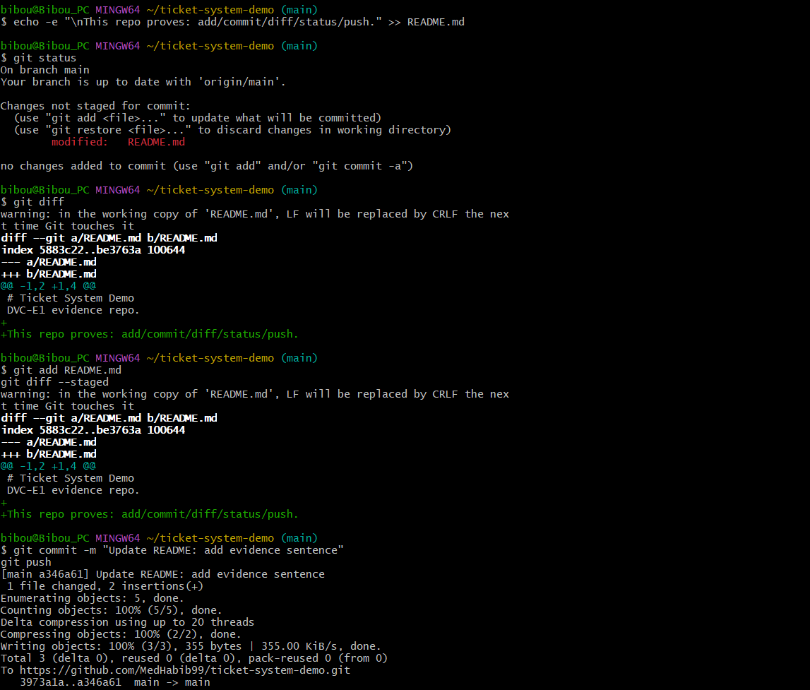
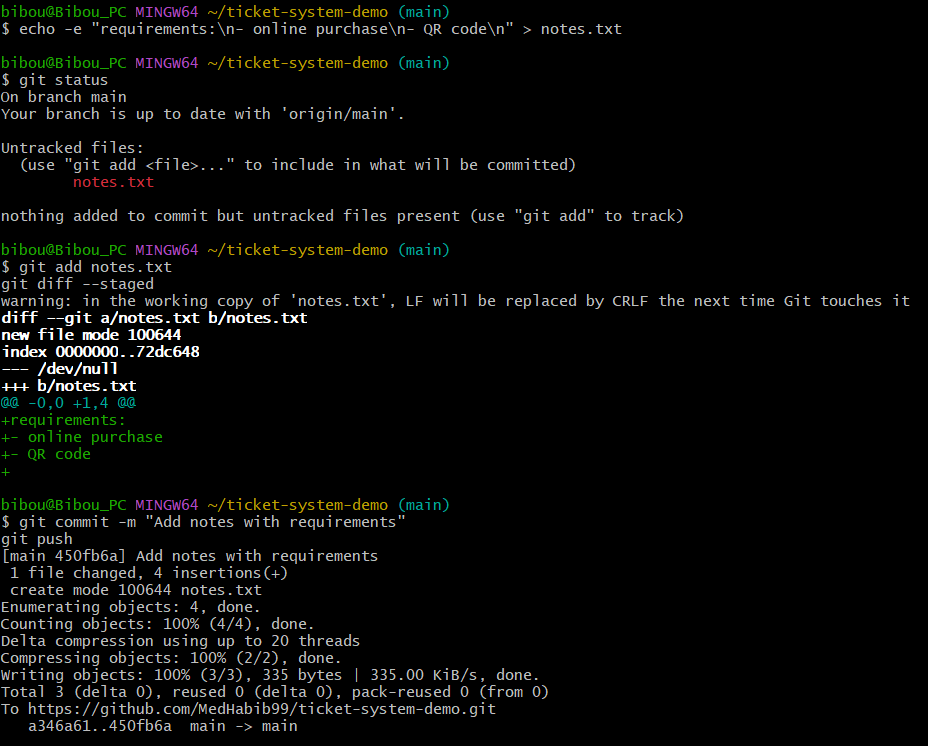
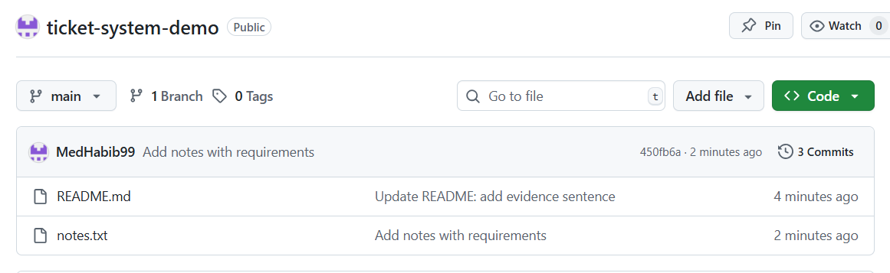

// Schritt 3
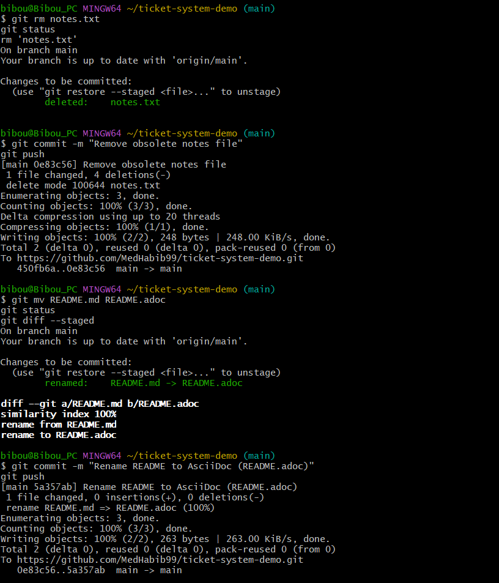
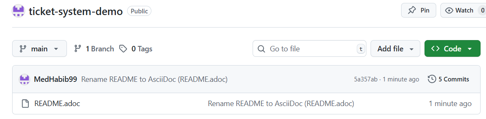

// Schritt 4
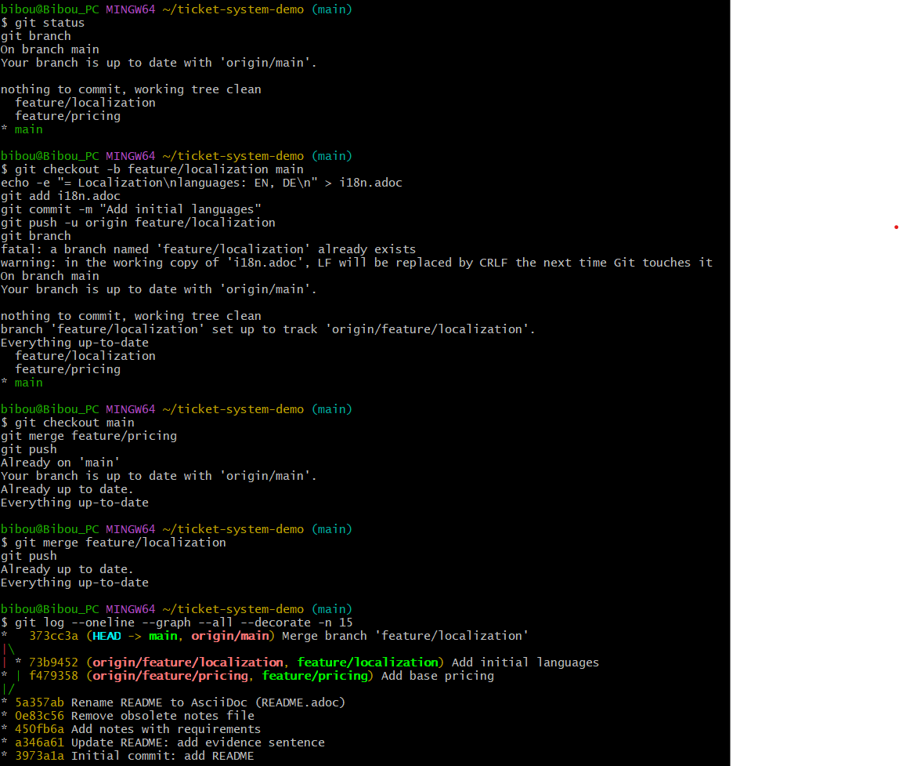
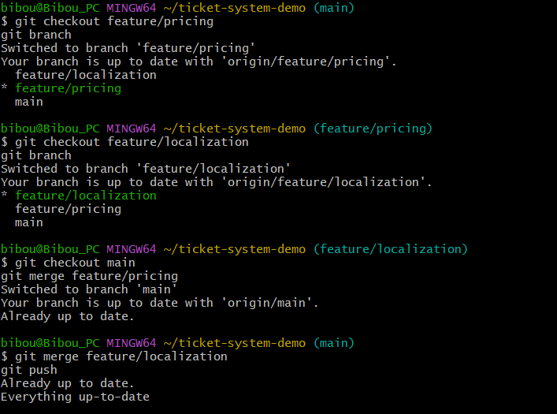
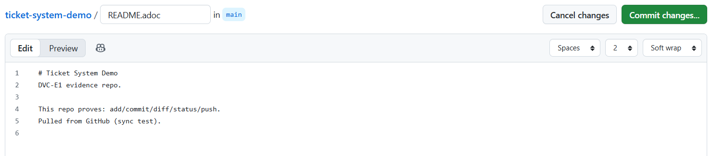

// Schritt 5
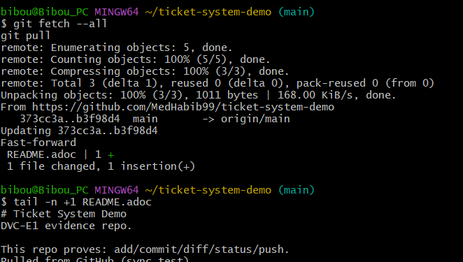
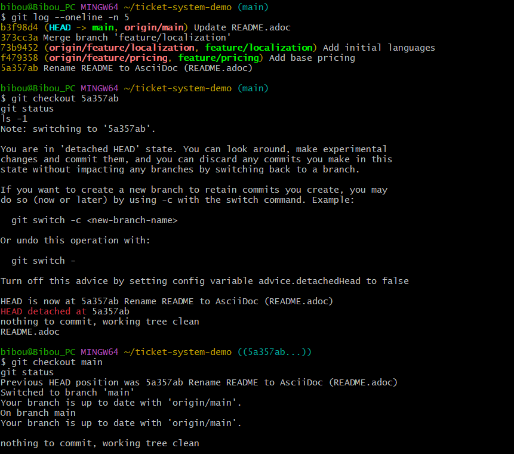

// Schritt 6
image::Evidence/13.png[width=900]

// Schritt 7
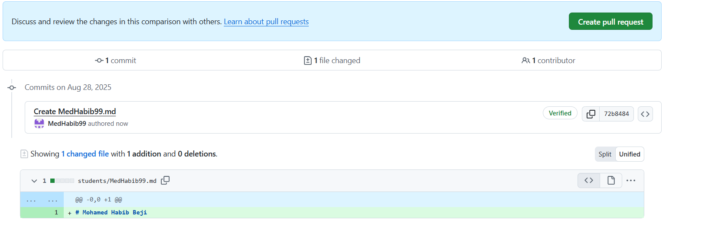

// Schritt 8 – PR an edlich/education
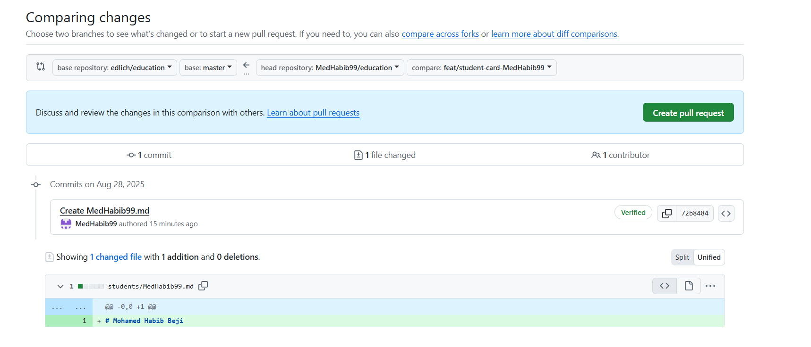
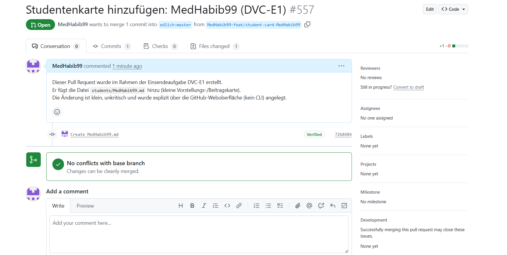
