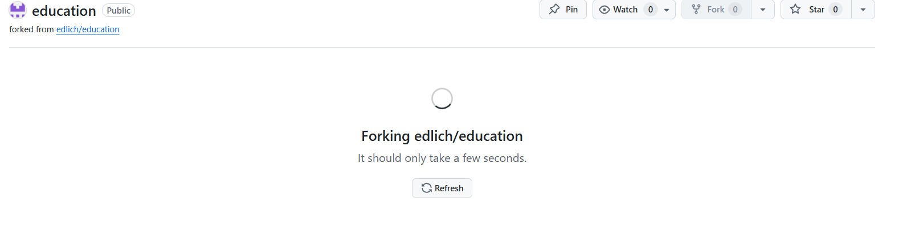

== DVC-E1 – Belege (Git/GitHub)

Öffentliches Repo: https://github.com/MedHabib99/ticket-system-demo
PR an Upstream (edlich/education): https://github.com/edlich/education/pull/557

// Schritt 1–2

// Schritt 3

// Schritt 4

image::Evidence/10.png[width=900]

// Schritt 5

// Schritt 6

// Schritt 7

// Schritt 8 – PR an edlich/education

